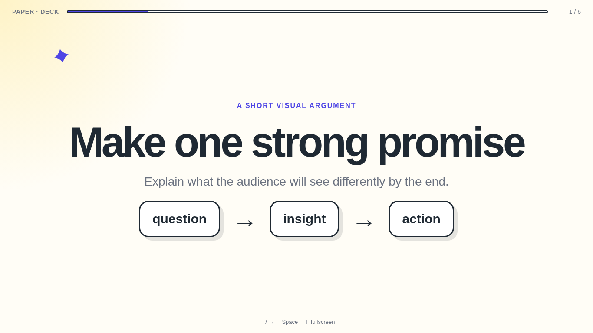

# Paper Deck Skill

An agent skill for creating playful, hand-drawn browser presentations with warm paper backgrounds, dark ink, indigo accents, thick borders, rounded cards, offset shadows, and purposeful motion.

The style is optimized for conceptual talks, workshops, technical explainers, and internal presentations. Every generated deck is plain HTML, CSS, and JavaScript that opens directly in a browser.



## Install

### OpenCode

```bash
git clone https://github.com/mnsosa/paper-deck-skill.git ~/.config/opencode/skills/paper-deck
```

OpenCode also discovers skills under `~/.agents/skills/` and `~/.claude/skills/`.

### Claude Code

```bash
git clone https://github.com/mnsosa/paper-deck-skill.git ~/.claude/skills/paper-deck
```

Restart the agent after installation so it reloads the skill metadata.

## Use

Ask naturally:

```text
Create a 12-slide browser presentation explaining event-driven architecture to product managers. Use the Paper Deck style and make retries visual.
```

The skill creates:

```text
my-deck/
├── index.html
├── styles.css
├── app.js
└── assets/
```

Open `index.html` directly. Navigate with arrow keys, space, clicks, or swipes. Press `F` for fullscreen.

## Included

- A complete responsive deck template
- Shared visual tokens and reusable scene primitives
- Keyboard, mouse, touch, progress, and fullscreen behavior
- Anime.js reveals with a no-network fallback
- Reduced-motion support
- Scene and writing recipes
- A Python validator
- Evaluation prompts for testing the skill

## Validate a generated deck

```bash
python3 scripts/validate_deck.py /path/to/deck
```

## License

MIT
